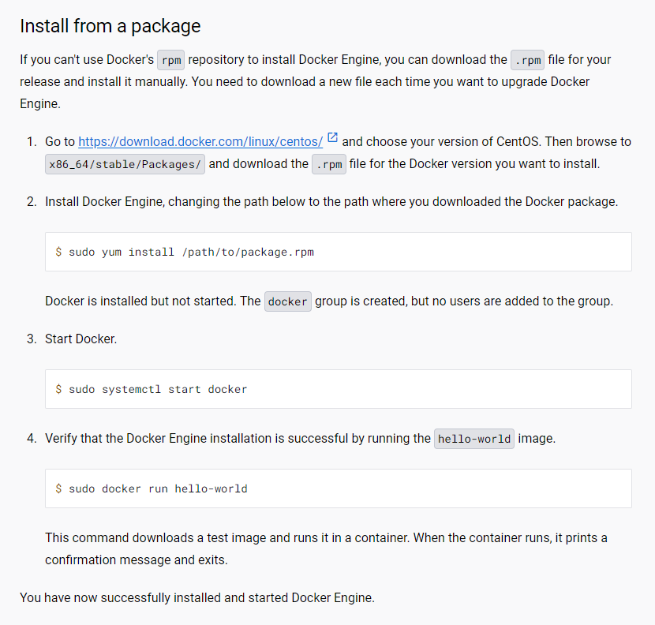

# 安装

官网安装方法:

https://docs.docker.com/engine/install/centos/

### 在线安装方式:

Set up the repository

```shell
sudo yum install -y yum-utils
sudo yum-config-manager --add-repo https://download.docker.com/linux/centos/docker-ce.repo
```

Install Docker Engine
```shell
sudo yum install docker-ce docker-ce-cli containerd.io docker-buildx-plugin docker-compose-plugin
```

Start Docker.

```shell
sudo systemctl start docker
```

Verify docker 
```shell
sudo docker run hello-world
```


### 离线安装方式：

https://docs.docker.com/engine/install/centos/#install-from-a-package




