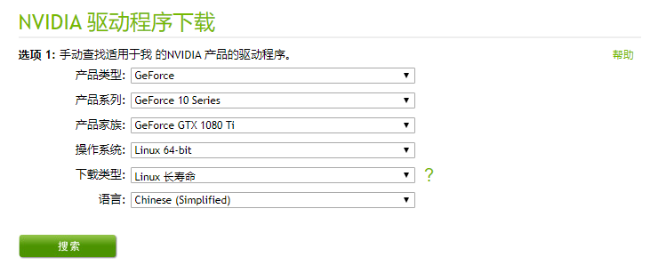
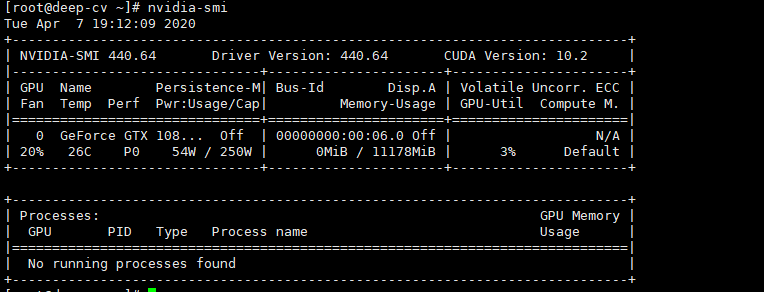
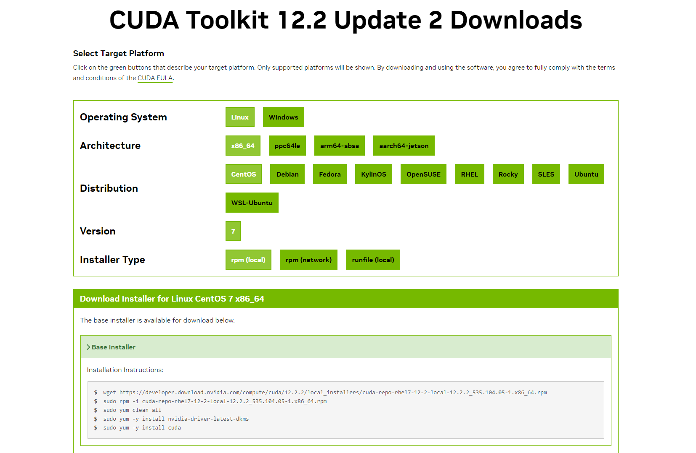
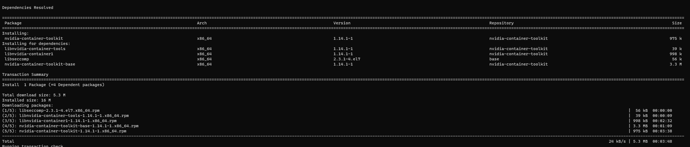
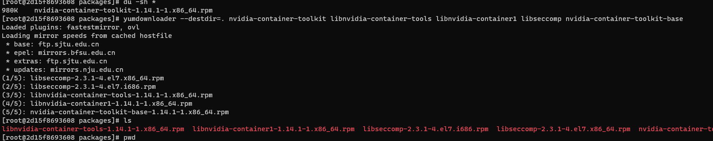

<!-- TOC -->
* [GPU环境部署](#gpu环境部署)
  * [一、CentOS安装Nvidia驱动](#一centos安装nvidia驱动)
    * [预、查询命令](#预查询命令)
  * [二、CentOS安装CUDA](#二centos安装cuda)
  * [三、Docker 配置宿主机 GPU](#三docker-配置宿主机-gpu)
    * [1. 在线安装](#1-在线安装)
      * [Installing with Apt](#installing-with-apt)
      * [Installing with Yum or Dnf](#installing-with-yum-or-dnf)
    * [2. 离线安装](#2-离线安装)
<!-- TOC -->

# GPU环境部署

## 一、CentOS安装Nvidia驱动

### 预、查询命令

```shell
1、Linux查看显卡信息 ps 若找不到lspci命令,可以安装 yum install pciutils
lspci | grep -i vga
2、使用nvidia GPU可以
lspci | grep -i nvidia
3、查看显卡驱动
cat /proc/driver/nvidia/version
```

1.安装依赖环境：

`yum install kernel-devel gcc -y`
 

2.检查内核版本和源码版本，保证一致

```shell
ls /boot | grep vmlinu

rpm -aq | grep kernel-devel
```

3. 在NVIDIA官网下载驱动

https://www.nvidia.cn/Download/index.aspx?lang=cn



4. install
```shell
chmod +x NVIDIA-Linux-x86_64-440.64.run

./NVIDIA-Linux-x86_64-440.64.run
```

5. 安装成功

```shell
nvidia-smi
```



## 二、CentOS安装CUDA

CUDA（Compute Unified Device Architecture）是显卡厂商 NVIDIA 推出的运算平台。 CUDA™ 是一种由 NVIDIA 推出的通用并行计算架构，该架构使 GPU 能够解决复杂的计算问题。 它包含了 CUDA 指令集架构（ISA）以及 GPU 内部的并行计算引擎。 开发人员现在可以使用 C 语言, C++ , FORTRAN 来为 CUDA™ 架构编写程序，所编写出的程序可以在支持 CUDA™ 的处理器上以超高性能运行。
对于采用 NVIDIA GPU 的云服务器或主机，需要安装 CUDA 开发运行环境。以目前最常用的 CUDA 7.5 为例，可参照以下步骤进行安装。

1. 官网下载 CUDA

https://developer.nvidia.com/cuda-downloads?target_os=Linux&target_arch=x86_64&Distribution=CentOS&target_version=7&target_type=rpm_local


2. 安装CUDA



3. 检查安装是否成功

查看CUDA版本： 可以通过运行以下命令来查看CUDA的版本

`nvcc --version`


## 三、Docker 配置宿主机 GPU

**NVIDIA Container Toolkit 使用户能够构建和运行 GPU 加速的容器。该工具包包括一个容器运行时库 和实用程序，用于自动配置容器以利用 NVIDIA GPU。**

### 1. 在线安装

Toolkit链接地址:

[https://docs.nvidia.com/datacenter/cloud-native/container-toolkit/latest/install-guide.html ](https://docs.nvidia.com/datacenter/cloud-native/container-toolkit/latest/install-guide.html)

#### Installing with Apt
Configure the repository:

```shell
curl -fsSL https://nvidia.github.io/libnvidia-container/gpgkey | sudo gpg --dearmor -o /usr/share/keyrings/nvidia-container-toolkit-keyring.gpg \
  && curl -s -L https://nvidia.github.io/libnvidia-container/stable/deb/nvidia-container-toolkit.list | \
    sed 's#deb https://#deb [signed-by=/usr/share/keyrings/nvidia-container-toolkit-keyring.gpg] https://#g' | \
    sudo tee /etc/apt/sources.list.d/nvidia-container-toolkit.list \
  && \
    sudo apt-get update
```
Install the NVIDIA Container Toolkit packages:

```shell
sudo apt-get install -y nvidia-container-toolkit
```

#### Installing with Yum or Dnf

Configure the repository:

```shell
curl -s -L https://nvidia.github.io/libnvidia-container/stable/rpm/nvidia-container-toolkit.repo | \
  sudo tee /etc/yum.repos.d/nvidia-container-toolkit.repo
```
Install the NVIDIA Container Toolkit packages:

```shell
sudo yum install -y nvidia-container-toolkit

```

### 2. 离线安装

内网环境下，yum和apt无法下载仓库包

先找一台centos7 的容器，启动后使用yum安装toolkit
```shell
yum install -y nvidia-container-toolkit
```


再使用yumdownloader 将依赖的文件包全部以rpm方式下载
```shell
yumdownloader --destdir=. nvidia-container-toolkit libnvidia-container-tools libnvidia-container1 libseccomp nvidia-container-toolkit-base
```



最后使用命令进行安装
```shell
yum install ***.rpm 
```