# Ray 资源管理监控

- [Ray 资源管理监控](#ray-资源管理监控)
  - [一、Ray 架构](#一ray-架构)
    - [1.GCS](#1gcs)
    - [2.分布式调度器](#2分布式调度器)
  - [二、Ray 资源管理](#二ray-资源管理)
    - [1.启动集群](#1启动集群)
    - [2.Node](#2node)
    - [3.Jobs](#3jobs)
    - [4.Actors](#4actors)
    - [5.LOGS](#5logs)
    - [6.Machine View](#6machine-view)
    - [7.Metrics View](#7metrics-view)
    - [8.python SDK API](#8python-sdk-api)


## 一、Ray 架构

Ray的架构由应用层和系统层组成，其中应用层实现了Ray的API，作为前端供用户使用，而系统层则作为后端来保障Ray的高可扩展性和容错性。
整体的架构图如下图所示：


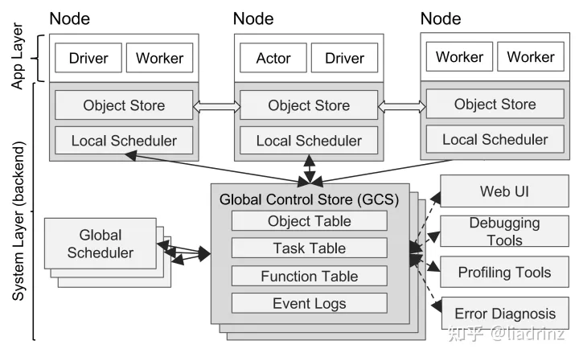


### 1.GCS
GCS设计的初衷是让系统中的各个组件都变得尽可能地无状态，因此GCS维护了一些全局状态：

* 对象表 (Object Table)：记录每个对象存在于哪些节点
* 任务表 (Task Table)：记录每个任务运行于哪个节点
* 函数表 (Function Table)：记录用户进程中定义的远程函数
* 事件日志 (Event Logs)：记录任务运行日志

### 2.分布式调度器

Ray中的任务调度器被分为两层，由一个全局调度器和每个节点各自的局部调度器组成。为了避免全局调度器负载过重，在节点创建的任务首先被提交到局部调度器，
如果该节点没有过载且节点资源能够满足任务的需求（如GPU的需求），则任务将在本地被调度，否则任务才会被传递到全局调度器，考虑将任务调度到远端。
由于Ray首先考虑在本地调度，本地不满足要求才考虑在远端调用，因此这样的调度方式也被称为自底向上的调度。
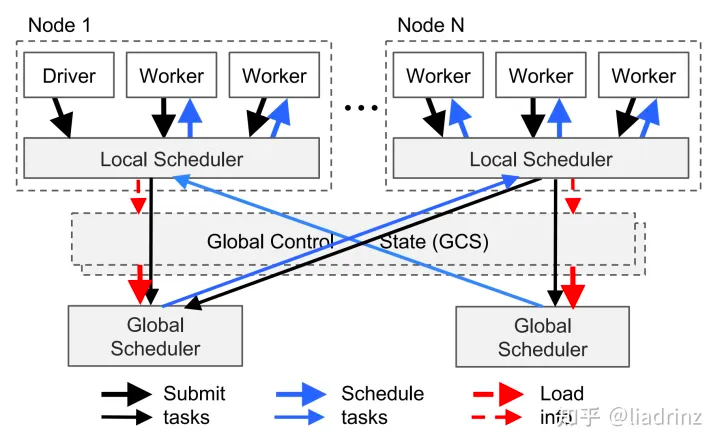

箭头的粗细表示过程发生频率的高低。用户进程和工作器向本地调度器提交任务，
1. 大多数情况下，任务将在本地被调度。
2. 少数情况下， 局部调度器会向全局调度器提交任务，并向GCS传递任务的相关信息，将任务涉及的对象和函数存入全局的对象表和函数表中， 然后全局调度器会从GCS中读取到信息， 并选择在其他合适的节点上调度这一任务。更具体地来说，全局调度器会根据任务的请求选出具有足够资源的一系列节点，并在这些节点中选出等待时间最短的一个节点。


## 二、Ray 资源管理

### 1.启动集群
```shell
ray start --head --node-ip-address="127.0.0.1" --port="9937" --resources='{"bob": 5}' --num-cpus="5"

# --dashboard-port 也可以指定端口号
```

默认dashboard 端口为8265,当然也可以通过ps -ef 查看DashBoard 的端口号
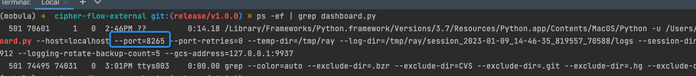


Dashboard 服务无法运行:
https://www.jianshu.com/p/40ff76cbf8ca

### 2.Node 
节点视图让您可以查看每个节点和每个工作人员的资源利用率信息。这也显示了将 GPU 资源分配给特定参与者或任务。

此外，机器视图让您可以查看节点或工作人员的日志。

最后，您可以看到每个工作人员当前正在执行的任务
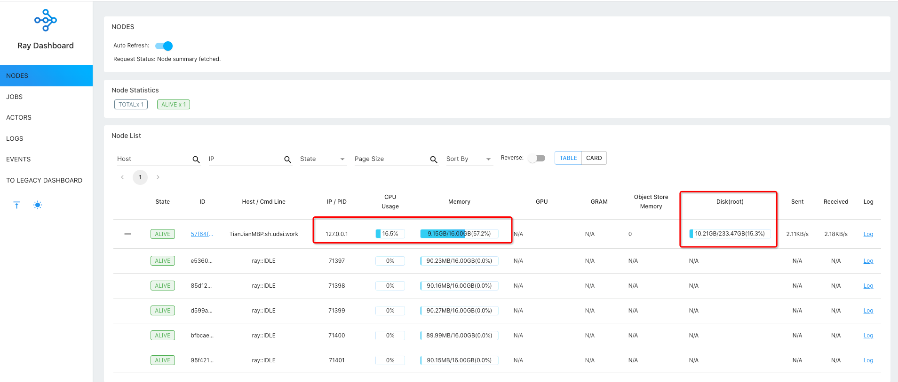

节点集群信息
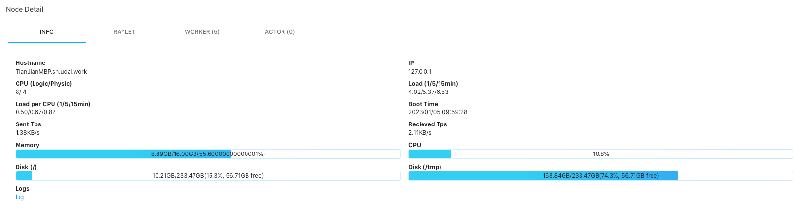

当前Worker
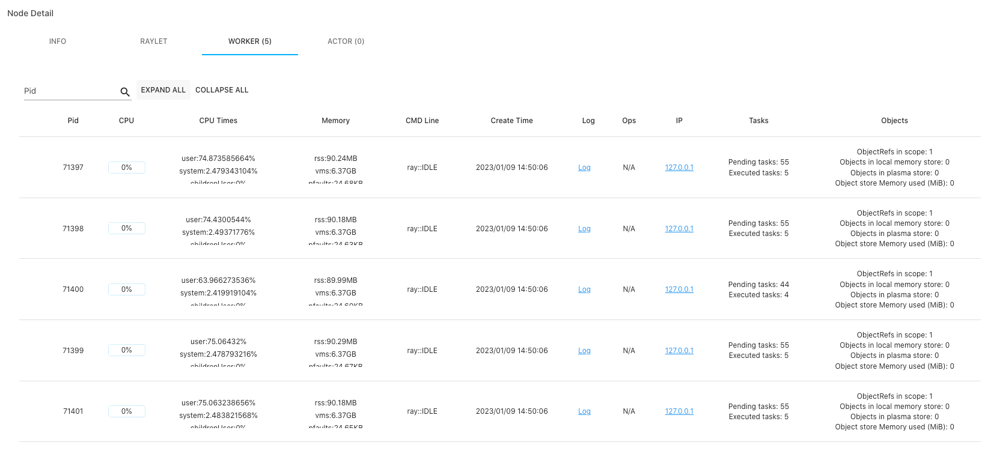

### 3.Jobs
Jobs 视图让您可以监控在 Ray 集群上运行的不同作业。作业是由入口点启动的射线工作负载。通常，作业是通过直接ray.init从 python 脚本调用 Ray 库或使用作业提交 api来启动的。
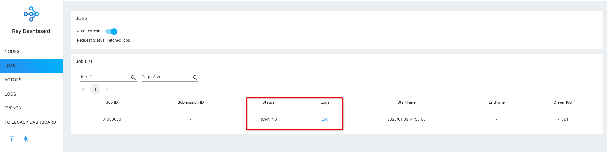

### 4.Actors

Actors 视图让您可以查看关于已存在于射线簇上的演员的信息。

您可以查看演员的日志，也可以查看哪个作业创建了演员。将存储多达 1000 名死亡演员的信息。可以RAY_DASHBOARD_MAX_ACTORS_TO_CACHE在启动 Ray 时使用环境变量覆盖此值。
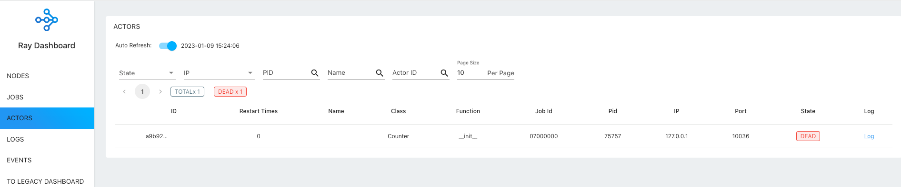

### 5.LOGS
日志视图可让您查看集群中的所有光线日志。它按节点和日志文件名组织。其他页面中的许多日志链接将链接到此视图并过滤列表，以便显示相关日志。
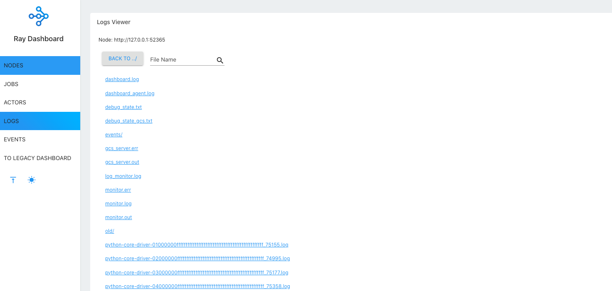

### 6.Machine View
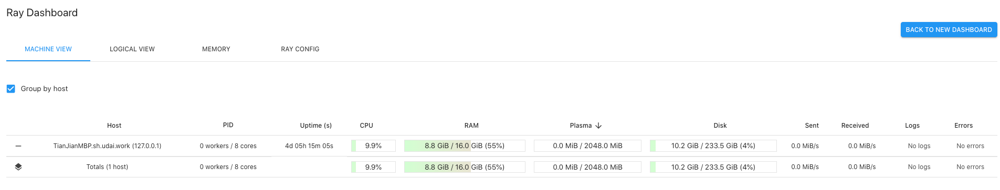


### 7.Metrics View 
集群中安装了 prometheus 和 grafana 还可以通过 Metrics View 查看集群中的各项指标
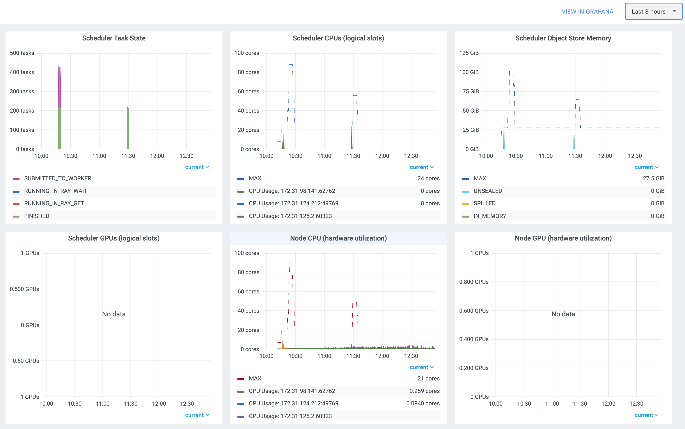

### 8.python SDK API
Ray 也是提供了接口的方式，可以获取到集群的状态，任务的信息，以及日志等。

[https://docs.ray.io/en/latest/cluster/running-applications/job-submission/jobs-package-ref.html](https://docs.ray.io/en/latest/cluster/running-applications/job-submission/jobs-package-ref.html)

比如查看任务状态

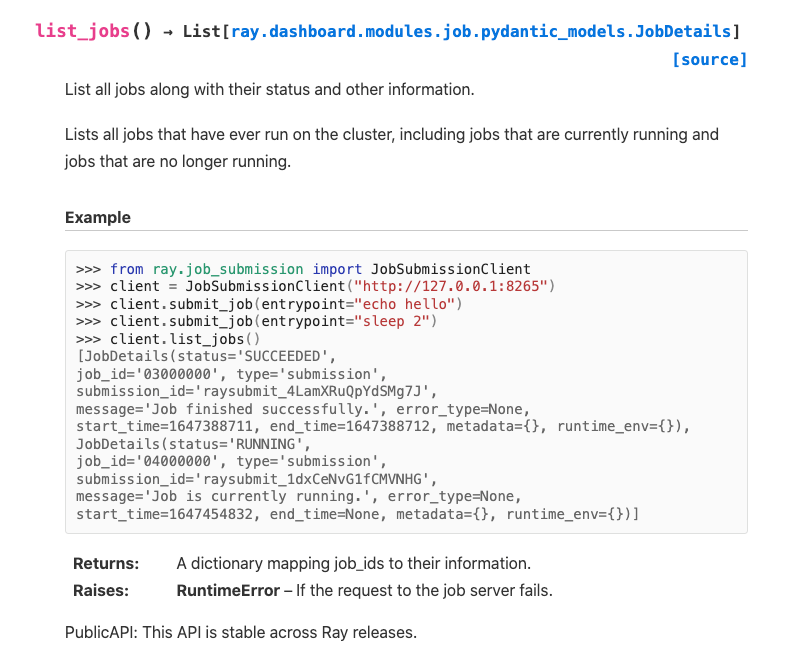