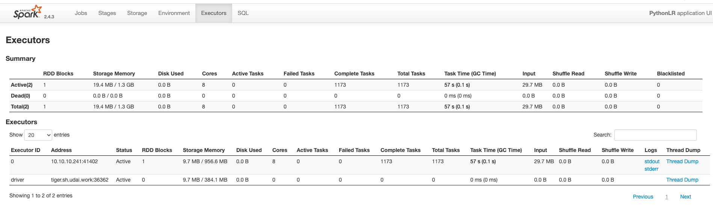

# Spark 资源管理监控

- [Spark 资源管理监控](#spark-资源管理监控)
  - [一、Spark 任务调度原理](#一spark-任务调度原理)
    - [1. Stage划分](#1-stage划分)
    - [2. Stage调度](#2-stage调度)
    - [3. Task调度](#3-task调度)
    - [4. Spark调度模式](#4-spark调度模式)
  - [二、资源监控](#二资源监控)
    - [Stage](#stage)
    - [DAG](#dag)
    - [Environment](#environment)
    - [Executor](#executor)
    - [REST API](#rest-api)

## 一、Spark 任务调度原理

Spark的核心是基于RDD来实现的，Spark任务调度就是如何组织任务去处理RDD中每个分区的数据，根据RDD的依赖关系构建DAG，基于DAG划分Stage，
然后将每个Stage中的任务（Task）分发到指定的节点去运行得到最终的结果。

* Application：用户编写的Spark应用程序，由一个或多个Job组成。提交到Spark之后，Spark会为Application分配资源，将程序进行转换并执行。
* Job（作业）：由Action算子触发生成的由一个或多个Stage组成的计算作业。
* Stage（调度阶段）：每个Job会根据RDD的宽依赖被切分为多个Stage，每个Stage都包含一个TaskSet。
* TaskSet（任务集）：一组关联的，但相互之间没有shuffle依赖关系的Task集合。一个TaskSet对应的调度阶段。
* Task（任务）：RDD中的一个分区对应一个Task，Task是单个分区上最小的处理流程单元。

Spark任务调度模块主要包含两大部分：DAGScheduler和TaskScheduler，它们负责将用户提交的计算任务按照DaG划分为不同的阶段并且将不同阶段的计算任务提交到集群进行最终的计算。

* DAGScheduler：主要负责分析用户提交的应用，并根据计算任务的依赖关系建立DAG，然后将DAG划分为不同的Stage，并以TaskSet的形式把Stage提交给TaskScheduler。其中每个Stage由可以并发执行的一组Task构成，这些Task的执行逻辑完全相同，只是作用于不同的数据。

* TaskScheduler：负责Application中不同job之间的调度，将TaskSet提交给Worker执行并返回结果，在Task执行失败时启动重试机制，并且为执行速度慢的Task启动备份的任务。

Spark 任务调度流程

### 1. Stage划分

用户提交的计算是一个由RDD构成的DAG，如果RDD在转换的时候需要做Shuffle，没那么这个Shuffle的过程就将这个DAG分为了不同的阶段（Stage）。由于Shuffle的存在，在不同的Stage是不能并行计算的，因为后面Stage的计算需要前面Stage的Shuffle的结果。而一个Stage由一组完全独立的计算任务（即Task）组成，每个Task的运算逻辑完全相同，只不过每个Task都会处理其对应的Partition。其中，Partition的数量和Task的数量是一致的，即一个Partition会被该Stage的一个Task处理。

* 划分依据：Stage的划分依据就是宽依赖。

* 核心算法：从触发Action操作的那个RDD开始从后往前推，首先会为最后一个RDD创建一个Stage，然后继续倒推，如果发现对某个RDD是宽依赖，那么就会将宽依赖的那个RDD创建一个新的Stage，那么RDD就是新的Stage的最后一个RDD。然后以此类推，直到所有的RDD全部遍历完成为止。

### 2. Stage调度

经过Stage划分之后，会产生一个或者多个互相关联的Stage。其中，真正执行Action算子的rDD所在的Stage被称为Final
Stage。DAGScheduler会从这个Final Stage生成作业实例。

在提交Stage时，DAGScheduler会先判断该Stage的父Stage的执行结果是否可用。如果所有父Stage的执行结果都可用，则提交该Stage。如果有任意一个父Stage的结果不可用，则尝试迭代提交该父Stage。

### 3. Task调度

TaskScheduler接收到DAGScheduler提交过来的TaskSet，会为每一个收到的TaskSet创建一个TaskSetManager。TaskSetManager负责TaskSet中Task的管理调度工作。

每个TaskScheduler都对应一个SchedulerBackend。其中TaskScheduler负责Application的不同Job之间的调度，在Task执行失败的时候启动重试机制，并且为执行速度慢的Task启动备份的任务。SchedulerBackend负责与Cluster
Manager交互，取得该Application分配到的资源，并且将这些资源传给TaskScheduler，由TaskScheduler为Task最终分配计算资源。

### 4. Spark调度模式

Spark可以采用两种调度模式：

* FIFO：先进先出调度模式（默认）。FIFO调度会根据StageID和JobID的大小来调度，数值较小的任务优先被调度。FIFO调度方式存在一个缺点：当遇到一个耗时较长的任务时，后续任务必须等待这个耗时任务执行完成才能得到可用的计算资源。

* FAIR：公平调度模式。FAIR模式下每个计算任务具有相等的优先级，Spark以轮询的方式为每个任务分配计算资源。FAIR不像FIFO那样必须等待前面耗时任务完成后后续任务才能执行。在FAIR模式下，无论是耗时短任务还是耗时长任务、无论是先提交的任务还是后提交的任务都可以公平的获得资源执行，这样就提高了耗时短的任务的响应时间。FAIR比FIFO更加灵活，FAIR模式为用户提供了一个调度池的概念，用户可以将重要的计算任务放入一个调度池Pool中，通过设置该调度池的权重来使该调度池中的计算任务获得较高的优先级。

修改任务调度模式:

## 二、资源监控

打开spark master 配置的web界面

可以看到Spark 集群，Workers下面目前连接两台服务器以及各自服务资源大小状况，
其中Running Applications 中为当前任务执行的状态，此次任务提交分配的资源为8Core,每个executor内存为2G

提交的jobs状态
按状态分组的作业详情：显示作业的详细信息，包括作业 ID、描述（带有指向详细作业页面的链接）、提交时间、持续时间、阶段摘要和任务进度条

所有任务的摘要指标都显示在表格和时间线中

* 任务反序列化时间
* 任务持续时间。
* GC 时间是 JVM 垃圾收集的总时间。
* 结果序列化时间是在将任务结果发送回驱动程序之前在执行程序上序列化任务结果所花费的时间。
* 获取结果时间是驱动程序从工作人员那里获取任务结果所花费的时间。
* 调度程序延迟是任务等待调度执行的时间。
* 峰值执行内存是在混洗、聚合和连接期间创建的内部数据结构使用的最大内存。
* 随机读取大小/记录。Total shuffle bytes read，包括本地读取的数据和从远程执行器读取的数据。
* Shuffle Read Fetch Wait Time是任务阻塞等待从远程机器读取随机数据所花费的时间。
* Shuffle Remote Reads是从远程执行器读取的总随机字节数。
* Shuffle Write Time是任务写入随机数据所花费的时间。
* Shuffle spill (memory)是内存中洗牌数据的反序列化形式的大小。
* Shuffle 溢出（磁盘）是磁盘上数据序列化形式的大小。

### Stage

### DAG
此作业的有向无环图的可视化表示，其中顶点表示 RDD 或数据帧，边表示要应用于 RDD 的操作

### Environment
环境选项卡显示不同环境和配置变量的值，包括 JVM、Spark 和系统属性。

### Executor
Executors 选项卡显示有关为应用程序创建的执行程序的摘要信息，包括内存和磁盘使用情况以及任务和随机信息。Storage Memory 列显示为缓存数据使用和保留的内存量。

### REST API
除了在 UI 中查看指标外，它们还可以 JSON 形式提供。spark提供了一种简单的方法来为 Spark 创建新的可视化和监控工具。
Spark为了方便用户对任务做监控，从1.4版本启用Rest服务，用户可以通过访问地址，得到application的运行状态。

[https://spark.apache.org/docs/3.3.1/monitoring.html#rest-api](https://spark.apache.org/docs/3.3.1/monitoring.html#rest-api)

